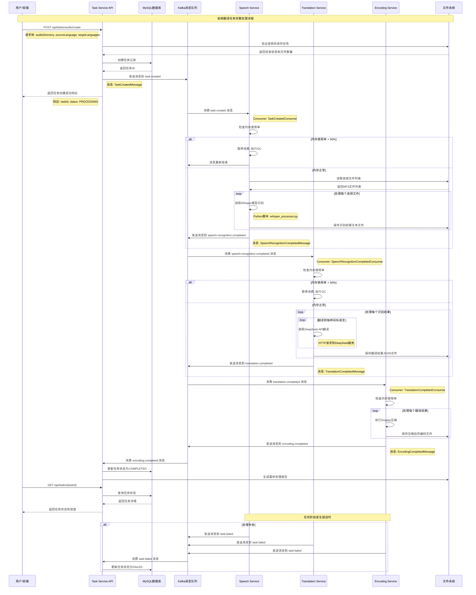

# 调用链路和流程架构

## 系统调用链路图



## 详细流程分解

### 1. 任务创建流程

```
用户请求创建任务
    ↓
验证请求参数
    ↓
检查音频目录是否存在
    ↓
统计音频文件数量
    ↓
生成唯一任务ID
    ↓
创建数据库记录
    ↓
发送Kafka消息启动处理
    ↓
返回任务创建成功响应
```

**关键步骤详解**:

1. **参数验证**: 检查audioDirectory、sourceLanguage、targetLanguages是否有效
2. **文件系统检查**: 验证音频目录存在且包含MP3文件
3. **数据库操作**: 使用MyBatis-Plus创建TranslationTask记录
4. **消息发送**: 通过KafkaTemplate发送TaskCreatedMessage到task.created主题
5. **状态同步**: 更新任务状态为PROCESSING

### 2. 语音识别流程

```
接收task.created消息
    ↓
内存使用率检查
    ↓
加载Whisper模型
    ↓
批量处理音频文件
    ↓
  ┌─ 文件1.mp3 → 识别 → 保存文本
  ├─ 文件2.mp3 → 识别 → 保存文本
  └─ 文件N.mp3 → 识别 → 保存文本
    ↓
汇总识别结果
    ↓
发送speech.recognition.completed消息
```

**内存管理机制**:
```
// 每次消费前检查内存
if (shouldStopConsuming()) {
    log.warn("内存使用率过高，暂停消息消费");
    forceGarbageCollection();
    return; // 消息重新投递
}

// 内存阈值检查
protected boolean shouldStopConsuming() {
    long usedMemory = memoryBean.getHeapMemoryUsage().getUsed();
    long maxMemory = memoryBean.getHeapMemoryUsage().getMax();
    double memoryUsageRatio = (double) usedMemory / maxMemory;
    return memoryUsageRatio > MEMORY_THRESHOLD; // 50%
}
```

### 3. 翻译处理流程

```
接收speech.recognition.completed消息
    ↓
内存使用率检查
    ↓
解析识别结果
    ↓
为每个文本执行多语言翻译
    ↓
  ┌─ 英文文本 → 中文翻译
  ├─ 英文文本 → 日文翻译
  └─ 英文文本 → 韩文翻译
    ↓
保存翻译结果到JSON文件
    ↓
发送translation.completed消息
```

**翻译模型切换**:
```java
// 接口抽象化设计
public interface TranslationService {
    TranslationResult translateText(String sourceText, String sourceLanguage, 
                                  String targetLanguage, Map<String, Object> options);
}

// 当前实现: DeepSeek
@Service
public class DeepSeekTranslationServiceImpl implements TranslationService {
    // DeepSeek API调用实现
}

// 可扩展实现
// @Service
// public class OpenAITranslationServiceImpl implements TranslationService {
//     // OpenAI API调用实现  
// }
```

### 4. 编码压缩流程

```
接收translation.completed消息
    ↓
内存使用率检查
    ↓
读取翻译结果文件
    ↓
执行Snappy压缩算法
    ↓
计算压缩统计信息
    ↓
保存编码结果
    ↓
发送encoding.completed消息
```

## 消息队列主题设计

### Kafka主题结构

```
translation-system-cluster
├── task.created (分区: 3, 副本: 1)
│   ├── 消息格式: TaskCreatedMessage
│   ├── 生产者: Task Service
│   └── 消费者: Speech Service
│
├── speech.recognition.completed (分区: 3, 副本: 1)
│   ├── 消息格式: SpeechRecognitionCompletedMessage
│   ├── 生产者: Speech Service
│   └── 消费者: Translation Service
│
├── translation.completed (分区: 3, 副本: 1)
│   ├── 消息格式: TranslationCompletedMessage
│   ├── 生产者: Translation Service
│   └── 消费者: Encoding Service
│
├── encoding.completed (分区: 3, 副本: 1)
│   ├── 消息格式: EncodingCompletedMessage
│   ├── 生产者: Encoding Service
│   └── 消费者: Task Service
│
└── task.failed (分区: 1, 副本: 1)
    ├── 消息格式: TaskFailedMessage
    ├── 生产者: All Services
    └── 消费者: Task Service
```

### 消息格式定义

**TaskCreatedMessage**:
```json
{
  "taskId": "uuid",
  "audioDirectoryPath": "/path/to/audio",
  "sourceLanguage": "en",
  "targetLanguages": "zh-CN,ja",
  "taskType": "AUDIO_TRANSLATION",
  "createdTime": "2025-06-04T10:30:00",
  "priority": 5
}
```

**SpeechRecognitionCompletedMessage**:
```json
{
  "taskId": "uuid",
  "audioDirectoryPath": "/path/to/audio",
  "recognitionResults": [
    {
      "audioFileName": "1.mp3",
      "recognizedText": "Hello world",
      "confidence": 0.95,
      "textFilePath": "/path/to/1_recognition.txt"
    }
  ],
  "sourceLanguage": "en",
  "targetLanguages": "zh-CN,ja",
  "completedTime": "2025-06-04T10:35:00"
}
```

## 文件系统结构

### 处理过程中的文件组织

```
audio-source/
└── Tilly's Lost Balloon/
    ├── 1.mp3                              # 原始音频文件
    ├── 2.mp3
    ├── ...
    ├── 8.mp3
    │
    ├── 1_recognition.txt                   # 语音识别结果
    ├── 2_recognition.txt
    ├── ...
    ├── 8_recognition.txt
    │
    ├── 1_translations.json                 # 翻译结果
    ├── 2_translations.json
    ├── ...
    ├── 8_translations.json
    │
    ├── 1_encoded.snappy                   # 编码压缩结果
    ├── 2_encoded.snappy
    ├── ...
    ├── 8_encoded.snappy
    │
    └── processing_result_2025-06-04.json  # 最终处理报告
```

### 文件内容示例

**识别结果文件 (1_recognition.txt)**:
```
音频文件: 1.mp3
识别时间: 2025-06-04 10:32:00
置信度: 0.95
处理时间: 2500ms
识别文本:
Once upon a time, there was a little elephant named Tilly who loved balloons.
```

**翻译结果文件 (1_translations.json)**:
```json
{
  "audioFileName": "1.mp3",
  "originalText": "Once upon a time, there was a little elephant named Tilly who loved balloons.",
  "sourceLanguage": "en",
  "translations": {
    "zh-CN": "从前，有一只名叫蒂莉的小象，她很喜欢气球。",
    "ja": "昔々、ティリーという名前の小さな象がいて、風船が大好きでした。"
  },
  "translationTime": "2025-06-04T10:33:00"
}
```

**最终处理报告 (processing_result_2025-06-04.json)**:
```json
{
  "taskId": "a1b2c3d4-e5f6-7890-abcd-ef1234567890",
  "folderName": "Tilly's Lost Balloon",
  "totalFiles": 8,
  "successCount": 8,
  "failureCount": 0,
  "successRate": 1.0,
  "totalOriginalSize": 45628,
  "totalCompressedSize": 27377,
  "compressionRatio": 0.6,
  "processingStartTime": "2025-06-04T10:30:05",
  "processingEndTime": "2025-06-04T10:45:30",
  "totalProcessingTime": "15分25秒",
  "stages": {
    "speechRecognition": {
      "duration": "8分30秒",
      "averageConfidence": 0.92
    },
    "translation": {
      "duration": "5分45秒", 
      "languagesProcessed": ["zh-CN", "ja"]
    },
    "encoding": {
      "duration": "1分10秒",
      "compressionAlgorithm": "Snappy"
    }
  }
}
```

## 错误处理和重试机制

### 错误传播流程

```
任何服务处理异常
    ↓
记录详细错误日志
    ↓
发送TaskFailedMessage到task.failed主题
    ↓
Task Service接收失败消息
    ↓
更新数据库任务状态为FAILED
    ↓
记录错误信息到error_message字段
    ↓
停止后续处理链路
```

### 重试策略

1. **Kafka消息重试**: 配置最大重试次数和重试间隔
2. **API调用重试**: DeepSeek API调用失败时的指数退避重试
3. **数据库操作重试**: 连接超时等临时性错误的重试

### 熔断机制

```java
// 服务熔断示例
@Component
public class CircuitBreakerService {
    private AtomicInteger failureCount = new AtomicInteger(0);
    private static final int FAILURE_THRESHOLD = 5;
    private static final long TIMEOUT_DURATION = 60000; // 1分钟
    
    public boolean isServiceAvailable() {
        return failureCount.get() < FAILURE_THRESHOLD;
    }
    
    public void recordFailure() {
        failureCount.incrementAndGet();
        // 设置恢复定时器
        scheduledExecutor.schedule(() -> failureCount.set(0), TIMEOUT_DURATION, TimeUnit.MILLISECONDS);
    }
}
```

## 性能监控点

### 关键性能指标

1. **任务处理延迟**: 从创建到完成的总时间
2. **各阶段处理时间**: 语音识别、翻译、编码各阶段耗时
3. **消息队列积压**: 各个主题的消息堆积情况
4. **服务内存使用**: 各服务的内存使用率变化
5. **API调用成功率**: DeepSeek API的调用成功率和响应时间

### 监控告警阈值

| 指标 | 警告阈值 | 严重阈值 |
|------|----------|----------|
| 任务处理时间 | > 30分钟 | > 60分钟 |
| 内存使用率 | > 70% | > 85% |
| 消息积压数量 | > 100 | > 500 |
| API错误率 | > 5% | > 15% |
| 服务响应时间 | > 5秒 | > 15秒 |

这个调用链路设计确保了系统的高可用性、可扩展性和可维护性，同时提供了完整的错误处理和监控机制。